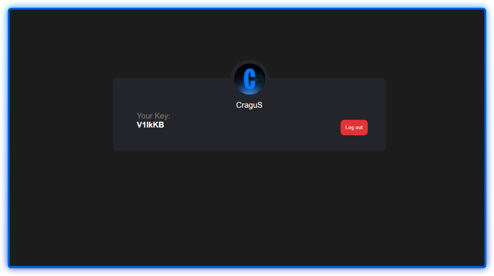
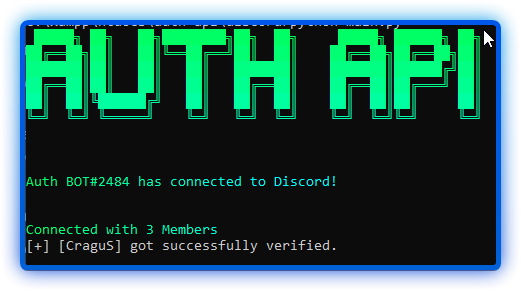
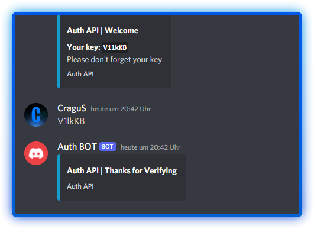

<div id="top"></div>


<br />
<div align="center">
  <a href="https://github.com/cragus-1902/auth-api/">
    
  </a>

  <h3 align="center">Auth API</h3>

  <p align="center">
    An awesome Auth API with Discord Interactions
    <br />
    <br />
    <br />
    <a href="https://github.com/cragus-1902/auth-api/">View Demo</a>
    ·
    <a href="https://github.com/cragus-1902/auth-api/issues">Report Bug</a>
    ·
    <a href="https://github.com/cragus-1902/auth-api/issues">Request Feature</a>
  </p>
</div>


<!-- TABLE OF CONTENTS -->
<details>
  <summary>Table of Contents</summary>
  <ol>
    <li>
      <a href="#about-the-project">About The Project</a>
      <ul>
        <li><a href="#built-with">Built With</a></li>
      </ul>
    </li>
    <li>
      <a href="#getting-started">Getting Started</a>
      <ul>
        <li><a href="#prerequisites">Prerequisites</a></li>
        <li><a href="#discord">Installation Discord Bot</a></li>
        <li><a href="#website">Installation Website</a></li>
      </ul>
    </li>
    <li><a href="#usage">Usage</a></li>
    <li><a href="#license">License</a></li>
    <li><a href="#contact">Contact</a></li>
  </ol>
</details>


## About The Project




  
A Simple Auth API with Discord interactions and verification system. Create your own databases and have an overview of your user data.

Featurs like Auto Server Join, Verify System, Database, reset/set key command


<p align="right">(<a href="#top">back to top</a>)</p>


### Built With

* [Python](https://www.python.org/)
* [PHP](https://www.php.net/manual/de/intro-whatis.php)

<p align="right">(<a href="#top">back to top</a>)</p>


### Prerequisites

* pip
  ```sh
  pip install -r requirements.txt
  ```
* php


<div id="discord"></div>

### Installation Discord Bot

1. Create a Discord Bot at [https://discord.com/developers/applications](https://discord.com/developers/applications)
2. Clone the repo
   ```sh
   git clone https://github.com/cragus-1902/auth-api.git
   ```
3. Install pip packages
   ```sh
   cd discord/
   pip install -r requirements.txt
   ```
4. Enter your Informations in `config.json`
   ```json
	{
		"BotToken": "DISCORD TOKEN",
		"guild_id": GUILD ID,
		"verify_role_id": VERIFY ROLE ID,
		"MySQL": {
		"host": "YOUR HOST",
		"user": "YOUR USERNAME",
		"password": "YOUR PASSWORD",
		"database": "YOUR DATABASE"
	}
   ```
5. Start Discord Bot 
   ```sh
   python main.py
   ```

<p align="right">(<a href="#top">back to top</a>)</p>


<div id="website"></div>

### Installation Website


1. Enter your Informations in `web/db/config.json`
   ```json
	{
		"BotToken": "YOUR DISCORD BOT TOKEN",
		"server_id": "GUILD ID",
		"oauth2_client_id": "YOUR DISCORD BOT CLIENT ID",
		"oauth2_client_secret": "YOUR DISCORD BOT CLIENT SECRET",
		"redirect_uri": "http://localhost/auth-api/web/"
	}
   ```
2. Enter your Informations in `web/db/database.php`
3. Import MySQL databse

<p align="right">(<a href="#top">back to top</a>)</p>


## License

Distributed under the MIT License. See `LICENSE` for more information.

<p align="right">(<a href="#top">back to top</a>)</p>


## Contact

Discord - CraguS#4867

Project Link: [https://github.com/cragus-1902/auth-api](https://github.com/cragus-1902/auth-api)

<p align="right">(<a href="#top">back to top</a>)</p>


